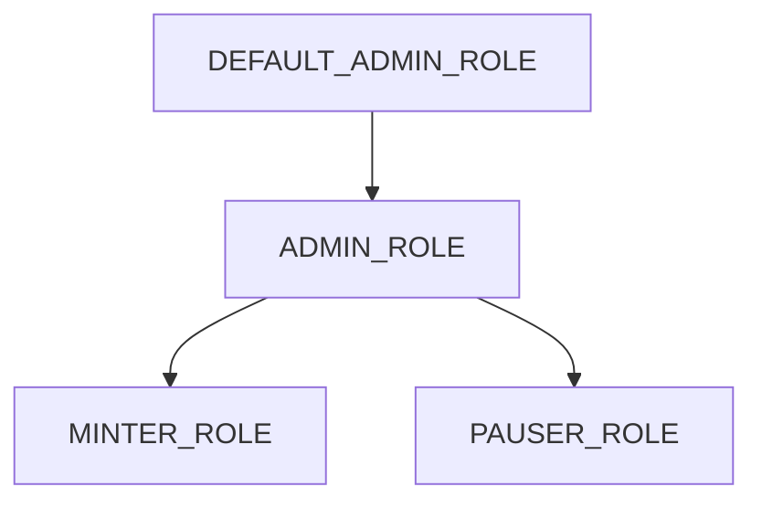

# ERC Standards

FOS smart contracts implement industry-standard Ethereum interfaces ensuring maximum compatibility with wallets, marketplaces, and tooling.

## ERC-721: Non-Fungible Token Standard

The ERC-721 standard defines the core interface for unique digital assets.

### Interface

```solidity
interface IERC721 {
    event Transfer(
        address indexed from, 
        address indexed to, 
        uint256 indexed tokenId
    );
    event Approval(
        address indexed owner, 
        address indexed approved, 
        uint256 indexed tokenId
    );
    event ApprovalForAll(
        address indexed owner, 
        address indexed operator, 
        bool approved
    );

    function balanceOf(address owner) external view returns (uint256);
    function ownerOf(uint256 tokenId) external view returns (address);
    function safeTransferFrom(address from, address to, uint256 tokenId) external;
    function transferFrom(address from, address to, uint256 tokenId) external;
    function approve(address to, uint256 tokenId) external;
    function getApproved(uint256 tokenId) external view returns (address);
    function setApprovalForAll(address operator, bool approved) external;
    function isApprovedForAll(address owner, address operator) external view returns (bool);
}
```

### Extensions Used

| Extension | Purpose |
|-----------|---------|
| **ERC721Enumerable** | Token enumeration by owner and index |
| **ERC721URIStorage** | Per-token metadata URI storage |
| **ERC721Burnable** | Optional token burning capability |

---

## ERC-2981: NFT Royalty Standard

Ensures creators receive royalties on secondary sales across all compatible marketplaces.

### Implementation

```solidity
import "@openzeppelin/contracts/token/common/ERC2981.sol";

contract FOSToken is ERC721, ERC2981 {
    constructor() {
        // Set default royalty: 5% to treasury
        _setDefaultRoyalty(treasury, 500); // 500 = 5%
    }
    
    function setDefaultRoyalty(
        address receiver, 
        uint96 feeNumerator
    ) external onlyRole(ADMIN_ROLE) {
        _setDefaultRoyalty(receiver, feeNumerator);
    }
}
```

### Royalty Calculation

| Sale Price | Royalty % | Creator Receives |
|------------|-----------|------------------|
| 1 ETH | 5% | 0.05 ETH |
| 10 ETH | 5% | 0.5 ETH |
| 100 ETH | 5% | 5 ETH |

---

## AccessControl

Role-based access system for administrative functions.

### Roles

```solidity
bytes32 public constant ADMIN_ROLE = keccak256("ADMIN_ROLE");
bytes32 public constant MINTER_ROLE = keccak256("MINTER_ROLE");
bytes32 public constant PAUSER_ROLE = keccak256("PAUSER_ROLE");
```

### Role Hierarchy



---

> **Info**: Continue to [Minting Mechanics](/docs/smart-contracts/minting) for detailed mint flow documentation.

